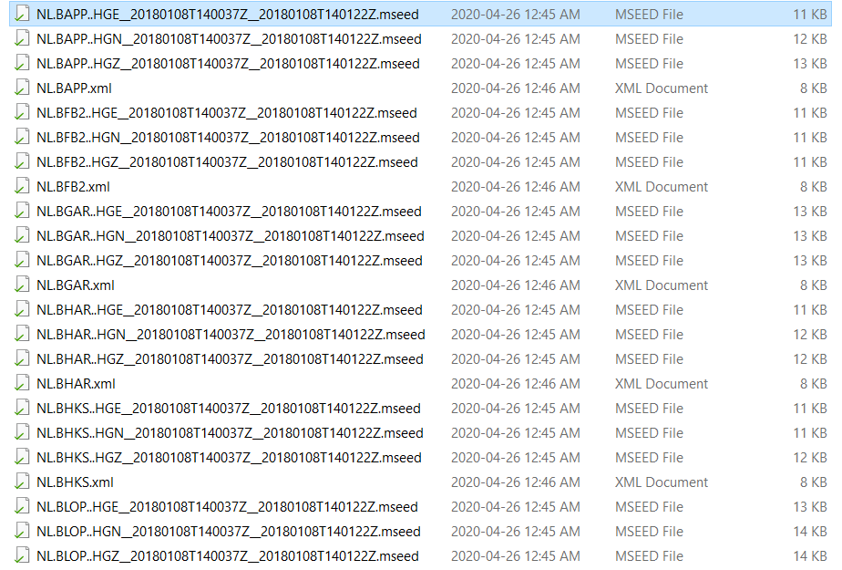

# Download and Process Earthquake Data with ObsPy and Python

Code to used ObsPy in order to search for earthquake events and subsequently download them, process them and plot them on the map.

For further information please follow me in the below links  
LinkedIn: https://www.linkedin.com/in/dimitris-dais/  
Email: d.dais@pl.hanze.nl  
ResearchGate: https://www.researchgate.net/profile/Dimitris_Dais2  
Research Group Page: https://www.linkedin.com/company/earthquake-resistant-structures-promising-groningen  

Add link to YouTube video

# get_events.py  
Code to get earthquake events from 2010-01-01 until 2020-04-25 from the Netherlands  
It will store the info of the events in an excel file  
It will plot the events on the map

To run the code please update the following folder paths according to your system:  
os.environ['PROJ_LIB']  
folder_output  

*Store the info of the events in an excel file with get_events.py*

=============
figgg
============= 

============= 

============= ==============
Unet          Linknet
============= ==============
|unet_image|  |linknet_image|
============= ==============

============= ==============
PSPNet        FPN
============= ==============
|psp_image|   |fpn_image|
============= ==============

.. _Unet: https://github.com/qubvel/segmentation_models/blob/readme/LICENSE
.. _Linknet: https://arxiv.org/abs/1707.03718
.. _PSPNet: https://arxiv.org/abs/1612.01105
.. _FPN: http://presentations.cocodataset.org/COCO17-Stuff-FAIR.pdf

.. |unet_image| image:: https://github.com/qubvel/segmentation_models/blob/master/images/unet.png
.. |linknet_image| image:: https://github.com/qubvel/segmentation_models/blob/master/images/linknet.png
.. |psp_image| image:: https://github.com/qubvel/segmentation_models/blob/master/images/pspnet.png
.. |fpn_image| image:: https://github.com/qubvel/segmentation_models/blob/master/images/fpn.png

